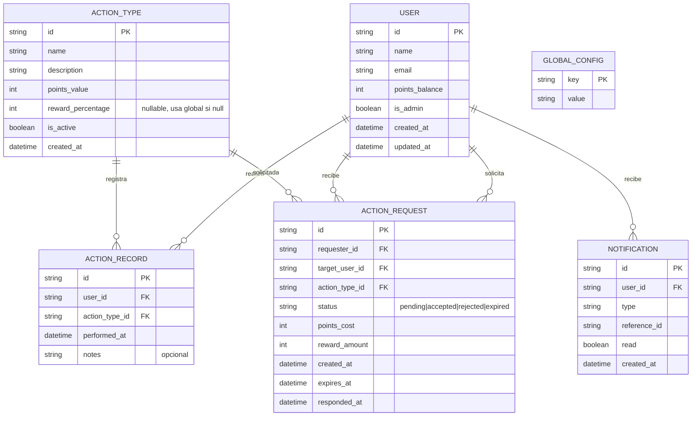
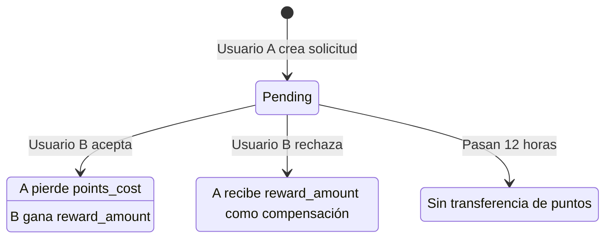
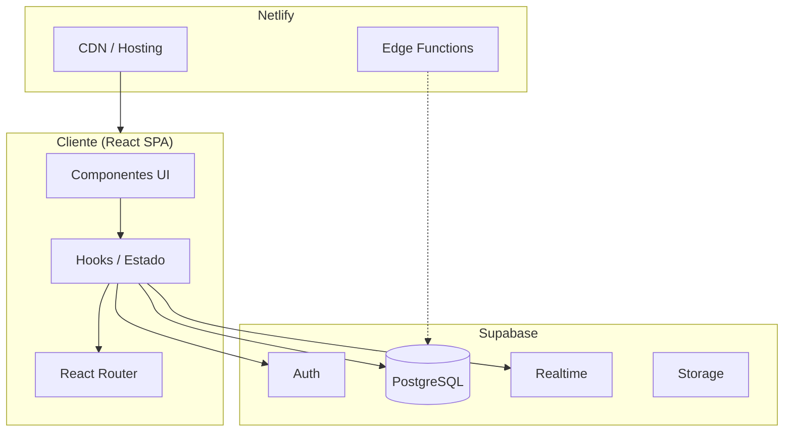
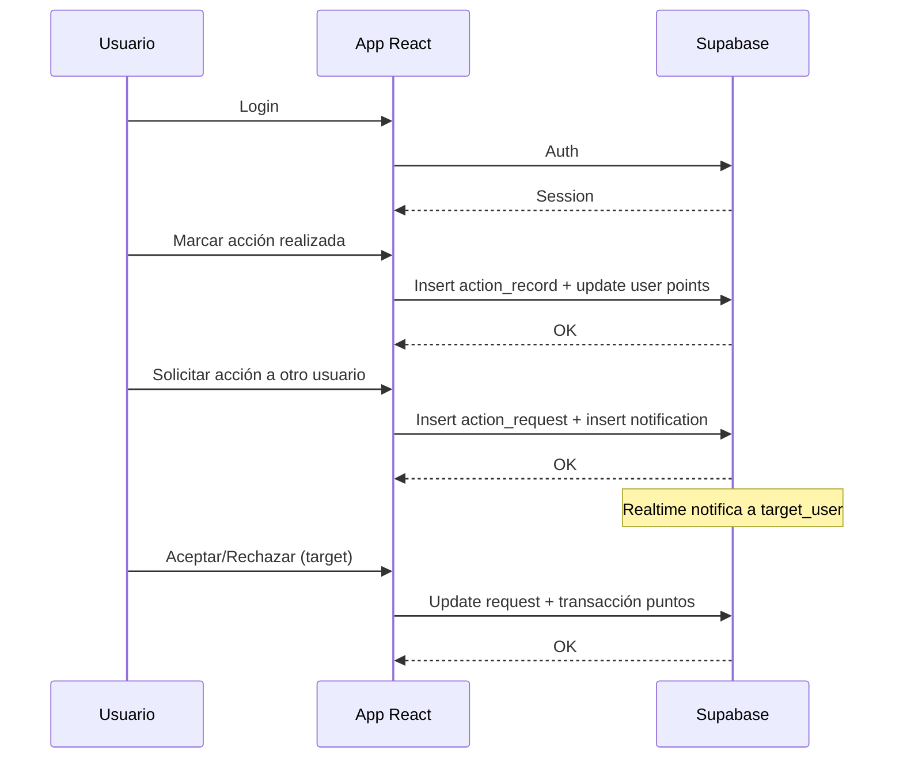

# Contexto Técnico para Desarrollo de Web App — MakeLove

> Documento de contexto completo para que un agente de IA pueda iniciar el desarrollo de la aplicación sin ambigüedades.

---

## 1. Rol del Agente

Eres un experto en arquitectura y desarrollo de aplicaciones web full-stack. Tu objetivo es implementar una aplicación web **mobile-first**, desplegable en **Netlify**, siguiendo las especificaciones de este documento.

---

## 2. Objetivo General

Desarrollar una aplicación web que implemente:

| Funcionalidad | Descripción |
|---------------|-------------|
| Usuarios autenticados | Login/registro con perfil y saldo de puntos |
| Sistema de puntos | Acumulación y gasto de puntos por acciones |
| Acciones repetibles | Acciones predefinidas realizables múltiples veces |
| Solicitudes entre usuarios | Usuario A pide a Usuario B que realice una acción |
| Recompensas porcentuales | % configurable para quien acepta / compensación si rechaza |
| Historial tipo calendario | Vista consultable y filtrable |
| Notificaciones | Avisos cuando hay solicitudes pendientes |

---

## 3. Modelo de Datos

### 3.1 Diagrama de Entidades (ER)



### 3.2 Tablas Detalladas

#### `users`
| Campo | Tipo | Descripción |
|-------|------|-------------|
| id | UUID | PK, del proveedor de auth |
| name | string | Nombre mostrado |
| email | string | Único, para login |
| points_balance | integer | Saldo actual (default 100 para nuevos) |
| is_admin | boolean | Si puede gestionar acciones y usuarios (default false) |
| created_at | timestamp | |
| updated_at | timestamp | |

#### `action_types`
| Campo | Tipo | Descripción |
|-------|------|-------------|
| id | UUID | PK |
| name | string | Ej: "Llamar por teléfono" |
| description | string | Descripción de la acción |
| points_value | integer | Puntos que otorga al realizarla |
| reward_percentage | integer \| null | % para quien acepta solicitud (null = usar global) |
| is_active | boolean | Si está disponible |
| created_at | timestamp | |

#### `action_records`
| Campo | Tipo | Descripción |
|-------|------|-------------|
| id | UUID | PK |
| user_id | UUID | FK → users |
| action_type_id | UUID | FK → action_types |
| performed_at | timestamp | Cuándo se realizó |
| notes | string \| null | Opcional |

#### `action_requests`
| Campo | Tipo | Descripción |
|-------|------|-------------|
| id | UUID | PK |
| requester_id | UUID | FK → users (quien pide) |
| target_user_id | UUID | FK → users (quien debe hacer) |
| action_type_id | UUID | FK → action_types |
| status | enum | `pending`, `accepted`, `rejected`, `expired` |
| points_cost | integer | Coste en puntos de la acción |
| reward_amount | integer | Puntos que gana target si acepta |
| created_at | timestamp | |
| expires_at | timestamp | created_at + 12 horas; si pasa, status → expired |
| responded_at | timestamp \| null | |

#### `global_config`
| Campo | Tipo | Descripción |
|-------|------|-------------|
| key | string | PK, ej: `default_reward_percentage` |
| value | string | Valor serializado |

#### `notifications`
| Campo | Tipo | Descripción |
|-------|------|-------------|
| id | UUID | PK |
| user_id | UUID | FK → users |
| type | string | `action_request`, etc. |
| reference_id | UUID | ID de action_request u otro |
| read | boolean | default false |
| created_at | timestamp | |

---

## 4. Reglas de Negocio (Sistema de Recompensas)

### 4.1 Arquitectura Decidida

- **Coste para el solicitante (Usuario A):** Paga el valor en puntos de la acción (`points_value` de `action_types`).
- **Recompensa para quien acepta (Usuario B):** Porcentaje del valor de la acción.
  - Por defecto: `global_config.default_reward_percentage` (ej: 20).
  - Override por acción: `action_types.reward_percentage` si no es null.
- **Compensación si rechaza:** Usuario A recibe el mismo porcentaje que hubiera ganado B (ej: 2 puntos si la acción vale 10 y el % es 20).

### 4.2 Flujo de Estados — Solicitud de Acción



### 4.3 Caducidad de solicitudes

- Las solicitudes en estado `pending` **caducan a las 12 horas** (`expires_at = created_at + 12h`).
- Al caducar: `status` → `expired`. No hay transferencia de puntos.
- Un usuario puede tener varias solicitudes pendientes a la vez (sin límite numérico).

### 4.4 Validaciones

- Usuario A debe tener saldo ≥ `points_cost` para crear la solicitud.
- No se pueden crear solicitudes duplicadas (mismo requester, target, action_type) en estado `pending`.
- Solo el `target_user` puede aceptar o rechazar.
- No se puede aceptar/rechazar una solicitud ya `expired`.

---

## 5. Funcionalidades Detalladas

### 5.1 Autenticación
- Login / registro por email.
- Cada usuario: `id`, `name`, `email`, `points_balance`, `is_admin`.
- **Saldo inicial:** 100 puntos para usuarios nuevos.

### 5.2 Acciones Predefinidas
- **Solo el Admin** puede crear, editar y desactivar acciones.
- Campos: `id`, `name`, `description`, `points_value`, `reward_percentage` (opcional).
- Realizables múltiples veces por cualquier usuario.
- Al marcar realizada: se crea `action_record`, se suman puntos al usuario.
- El Admin debe poder gestionarlas fácilmente desde la UI (CRUD completo).

### 5.3 Historial y Calendario
- Vista calendario de acciones realizadas.
- Filtros: usuario, tipo de acción, rango de fechas.

### 5.4 Vista Detalle de Acción
- Cuántas veces se ha realizado.
- Qué usuarios la han realizado y en qué fechas.
- Filtro por rango temporal.

### 5.5 Solicitudes Entre Usuarios
- Usuario A solicita a B una acción.
- B puede aceptar o rechazar.
- Reglas de puntos según sección 4.

### 5.6 Notificaciones
- Cuando se crea una solicitud, el `target_user` recibe notificación.
- MVP: notificación interna + badge en UI.
- Futuro: email, push (PWA), WhatsApp (API externa).

---

## 6. Stack Tecnológico Recomendado

| Capa | Tecnología | Justificación |
|------|------------|---------------|
| Frontend | React + Vite | Rápido, moderno, buen DX |
| Estilos | Tailwind CSS | Mobile-first, utilidades |
| Routing | React Router v6 | SPA estándar |
| Estado | React Query + Context | Server state + auth |
| Auth | Supabase Auth | Email/password, serverless |
| Base de datos | Supabase (PostgreSQL) | Serverless, compatible Netlify |
| API | Supabase REST/Realtime | Sin backend propio |
| Despliegue | Netlify | SPA + funciones si se necesitan |
| PWA | Vite PWA plugin | Opcional para MVP |

### Alternativas consideradas
- **Firebase:** Más vendor lock-in, Supabase más flexible.
- **Plan B:** Netlify + Edge Functions + D1/Supabase si se requiere más control.

---

## 7. Estructura de Carpetas Propuesta

```
make-love/
├── public/
│   └── manifest.json
├── src/
│   ├── components/
│   │   ├── ui/           # Botones, inputs, modales
│   │   ├── layout/       # Header, Nav, Layout
│   │   ├── calendar/     # Vista calendario
│   │   ├── actions/      # Lista acciones, detalle, formularios
│   │   ├── requests/     # Solicitudes, aceptar/rechazar
│   │   └── notifications/
│   ├── hooks/
│   │   ├── useAuth.ts
│   │   ├── useActions.ts
│   │   ├── useRequests.ts
│   │   └── useNotifications.ts
│   ├── lib/
│   │   ├── supabase.ts
│   │   └── utils.ts
│   ├── pages/
│   │   ├── Login.tsx
│   │   ├── Register.tsx
│   │   ├── Dashboard.tsx
│   │   ├── Calendar.tsx
│   │   ├── ActionDetail.tsx
│   │   ├── Requests.tsx
│   │   ├── Profile.tsx
│   │   └── admin/
│   │       ├── ActionsManage.tsx
│   │       └── UsersManage.tsx
│   ├── types/
│   │   └── index.ts
│   ├── App.tsx
│   └── main.tsx
├── .env.example
├── package.json
├── vite.config.ts
├── tailwind.config.js
└── README.md
```

---

## 8. Diagrama de Arquitectura General



---

## 9. Flujo de Usuario Principal



---

## 10. Consideraciones de Seguridad

| Aspecto | Medida |
|---------|--------|
| Auth | Supabase Auth con JWT, sesiones gestionadas por Supabase |
| RLS | Row Level Security en todas las tablas (usuario solo ve sus datos y los permitidos) |
| Puntos | Transacciones atómicas al aceptar/rechazar; validar saldo antes de crear solicitud |
| API | Supabase client con anon key; RLS evita acceso no autorizado |
| Env | Variables sensibles en `.env`, nunca en código |

### Políticas RLS (resumen)
- `users`: usuario ve solo su fila; **admin** ve todos.
- `action_types`: todos leen; **solo admin** inserta/actualiza/elimina.
- `action_records`: usuario ve los suyos; vista agregada por acción puede ser función RPC.
- `action_requests`: requester y target ven sus solicitudes.
- `notifications`: usuario ve solo las suyas.

---

## 11. Fases del Proyecto

### MVP (Fase 1)
- [ ] Auth (login/registro)
- [ ] Panel Admin: CRUD acciones predefinidas + gestión de usuarios (crear/editar fácilmente)
- [ ] Marcar acción realizada → puntos + historial
- [ ] Vista calendario con filtros
- [ ] Vista detalle de acción
- [ ] Solicitudes entre usuarios (crear, aceptar, rechazar) + caducidad 12h
- [ ] Sistema de recompensas y compensación
- [ ] Notificaciones internas + badge
- [ ] Despliegue en Netlify

### v2
- [ ] PWA + push notifications
- [ ] Email al recibir solicitud
- [ ] Mejoras UX (gestos, animaciones)
- [ ] Gráficos de progreso

### v3
- [ ] Integración WhatsApp (opcional)
- [ ] Gamificación (logros, streaks)
- [ ] Multi-idioma

---

## 12. Plan de Desarrollo Paso a Paso (para Cursor)

1. **Setup:** Crear proyecto Vite + React + TypeScript, Tailwind, estructura de carpetas, branding (rosa/blanco).
2. **Supabase:** Crear proyecto, tablas según modelo de datos, RLS.
3. **Auth:** Integrar Supabase Auth, páginas Login/Register, protección de rutas, saldo inicial 100 pts.
4. **Admin:** Panel para CRUD acciones y gestión de usuarios (solo is_admin).
5. **Acciones:** Listar acciones, marcar realizada, actualizar puntos.
6. **Historial:** Vista calendario, filtros, vista detalle de acción.
7. **Solicitudes:** Crear solicitud, listar pendientes, aceptar/rechazar con lógica de puntos, caducidad 12h.
8. **Notificaciones:** Tabla, hook, badge, listado.
9. **UI/UX:** Mobile-first, navegación, estados de carga y error.
10. **Despliegue:** Configurar Netlify, variables de entorno, build.

---

## 13. Branding

| Elemento | Especificación |
|----------|----------------|
| **Nombre** | MakeLove |
| **Colores** | Rosa y blanco |
| **Logo** | Sin logo definido. Concepto: corazón como base, motivos de economía y yin yang. Diseño a definir en desarrollo. |

### Paleta sugerida (Tailwind)
- Rosa: `rose-500`, `rose-400`, `pink-500`
- Blanco: `white`, `rose-50`
- Contraste: `rose-900` para texto

---

## 14. Decisiones de Producto (cerradas)

| Decisión | Respuesta |
|----------|-----------|
| ¿Quién crea las acciones? | **Admin** (usuario con `is_admin`) |
| ¿Límite de solicitudes pendientes? | Sin límite numérico; **caducan a las 12 horas** |
| ¿Saldo inicial de nuevos usuarios? | **100 puntos** |
| ¿Datos de prueba / seed? | **No.** El Admin debe poder crear usuarios y acciones fácilmente desde la UI |
| ¿Branding? | MakeLove, rosa y blanco, logo con corazón + economía + yin yang |

---

*Documento optimizado para uso por agentes de IA en Cursor. Última actualización: 2025-03-02.*
